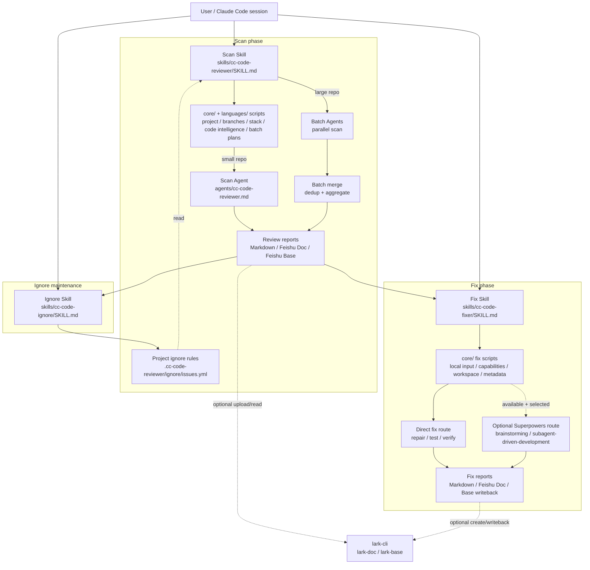

# AGENTS.md

This file provides guidance to Codex (Codex.ai/code) when working with code in this repository.

## Project Overview

This is a **claudecode plugin skill** for enterprise-grade Java code review and report-driven fixing. It provides 15-dimension comprehensive analysis with 4 review modes (fast/standard/deep/security), supports incremental and stock review types, and can use review reports as input for a controlled fix stage.

**Important**: This repository intentionally uses **skill-only entry points** plus dedicated sub-agents. Claude Code can invoke the skills explicitly via `/cc-code-reviewer:cc-code-reviewer` for scan, `/cc-code-reviewer:cc-code-ignore` for scan ignore-rule maintenance, and `/cc-code-reviewer:cc-code-fixer` for fix.

- **Multi-language support**: supports Java, the frontend family (React, Vue 2.x, Vue 3.x, Node.js, TypeScript, JavaScript), and Python (Django, FastAPI, generic Python). The unified entry `/cc-code-reviewer:cc-code-reviewer` auto-routes by language detection; mixed repos require the user to pick one language. The frontend path uses a language-neutral shared kernel (`scripts/core/`) plus a frontend adapter (`scripts/languages/frontend/`) and sub-agent (`agents/cc-code-reviewer-frontend.md`); the Python path uses the same kernel plus a Python adapter (`scripts/languages/python/`) and sub-agent (`agents/cc-code-reviewer-python.md`). Vue 2/3 and React signals coexist (common in monorepos) Vue wins arbitration; Vue2 legacy projects receive stronger Vue2-specific review rules. See `docs/superpowers/specs/2026-06-23-multi-language-reviewer-design.md`.

- **Three-agent plugin compatibility (v1.5.0)**: the same Git repository can be installed by Claude Code, Codex CLI/Desktop, and ZCode. All three native manifests discover root `skills/`, which is the single authoritative workflow. Each Skill selects the adapter from the current host identity and resolves `PLUGIN_ROOT` from its own resource location; it never guesses from installed tools or cwd. Shared logic uses `RUNTIME_ID`, `PLUGIN_ROOT`, `MODEL_PROFILE`, `INTERACT`, and `DISPATCH_AGENT`; it does not use `${CLAUDE_PLUGIN_ROOT}`, Claude `subagent_type`, or concrete model IDs. Version truth lives in `VERSION`; versioned plugin manifests must match it, while the Codex marketplace index resolves version through its local source.

## Architecture

### Overview



### Key Responsibilities

**Main Skill (`skills/cc-code-reviewer/SKILL.md`)**:
- Pre-scan: project detection → branch detection → project scan → jdtls/code-intelligence detection → lark-cli detection
- Reads `.cc-code-reviewer/ignore/issues.yml` after pre-scan and injects AI-readable skip rules into the scan agent
- Interactive mode: Collect user config via INTERACT after pre-scan: review mode → model → report handling → review entry → scope → optional stock strategy → optional batch selection/concurrency → final confirmation
- Batch mode: Auto-triggered for large stock reviews or when a Maven multi-module stock strategy is selected; uses deterministic planner scripts, dispatches parallel sub-agents, gates merge on current-run batch status, and reports included/leftover batches
- Maven large-repo mode: for Maven multi-module stock full-code or selected-module reviews using `module-sequential` or `ai-planned`, creates `.cc-code-reviewer/runs/{RUN_ID}` with atomic module/directory batches, status files, resumable execution, and staged/full merge reports
- File batch mode: for Maven single-module, Gradle, or unknown Java projects when `BATCH_MODE=true`, uses `languages/java/plan-file-batches.sh` and `file-token-batching`
- Feishu upload: after the review sub-agent returns the local report file (single-agent mode) or after batch merge (batch mode), the main skill performs all Feishu cloud-doc / bitable uploads per `FEISHU_UPLOAD_OPTION`; sub-agents never upload to Feishu
- **Never** execute code review itself

**Review Agent (`agents/cc-code-reviewer.md`)**:
- Execute actual code review with injected parameters
- Apply project ignore rules before generating the final issue list, and disclose matched rules / filtered issue counts
- In Maven large-repo batches, read `BATCH_PLAN_PATH`, keep formal findings inside `scan_roots`, and use `jdtls-lsp` semantic queries when `SEMANTIC_LEVEL=jdtls-lsp`
- Generate structured report
- Save local Markdown report only; never upload to Feishu (the main skill handles all Feishu uploads)
- **Never** interact with user via INTERACT

**Ignore Skill (`skills/cc-code-ignore/SKILL.md`)**:
- Read a scan issue list from Feishu Base or local Markdown
- Let the user specify issue numbers only as temporary selectors
- Write representative AI instruction rules to `.cc-code-reviewer/ignore/issues.yml`
- **Never** store transient report issue numbers in the ignore file

**Fix Skill (`skills/cc-code-fixer/SKILL.md`)**:
- Normalize fix input from local Markdown, Feishu Doc, or Feishu Base
- Preflight: project detection → branch detection → project scan → lark-cli detection → optional Superpowers capability detection
- Collect confirmed issue scope and output target via INTERACT
- Execute the default direct-fix route itself after user confirmation
- Show the Superpowers route only when the required skills are installed and the user selects it

### Execution Contract (Highest Priority)

These rules **must** be strictly followed:

1. **Pre-scan before interaction**: Execute scan/fix preflight scripts first, collect environment data
2. **Summary before questions**: Output a preflight summary once, only after the required scripts complete
3. **Structured interaction**: In interactive mode, use INTERACT for each step separately
4. **Scan stays interactive**: Scan and Fix stages both require structured human confirmation.
5. **No text replacement**: Never use plain text questions to replace INTERACT steps
6. **Never skip summary**: Even if all parameters provided, always show pre-scan summary
7. **Fix stage honors confirmed scope**: `cc-code-fixer` must only repair the confirmed issue set
8. **Fix stage defaults to direct repair**: Superpowers is optional and only appears when installed; no dedicated fix sub-agent is used
9. **Ignore stores problem classes**: `cc-code-ignore` writes AI-readable same-kind skip rules, not report issue numbers

## File Structure

```
skills/cc-code-reviewer/SKILL.md    # Main skill definition (entry point)
skills/cc-code-ignore/SKILL.md      # Scan ignore-rule maintenance skill
skills/cc-code-fixer/SKILL.md       # Fix-stage skill definition
agents/cc-code-reviewer.md          # Sub agent for review execution
runtime/                            # Three-agent runtime adapters (v1.5.0)
  ├── contract.md                   # Platform-neutral runtime contract
  ├── claude-code.md                # INTERACT / Claude Agent mapping
  ├── codex.md                      # Codex interaction / subagent mapping
  └── zcode.md                      # ZCode interaction / subagent mapping
.claude-plugin/                     # Claude Code manifest + marketplace
.codex-plugin/                      # Codex native manifest
.zcode-plugin/                      # ZCode native manifest
.agents/plugins/                    # Codex Git Marketplace manifest
VERSION                             # Single source of truth for plugin version
references/
  ├── languages/
  │   ├── java/
  │   │   └── review-framework.md     # Java 15 dimensions definition + mode matrix
  │   ├── frontend/
  │   │   └── review-framework.md     # Frontend 12 dimensions (independent set; dim 12 design-system deep-only)
  │   └── python/
  │       └── review-framework.md     # Python 12 dimensions (Django + FastAPI + generic; independent set)
  ├── report-format.md                # Report output format specification
  ├── feishu-integration.md           # Feishu upload operation reference
  ├── ignore-workflow.md              # Project-level ignore rule format and workflow
  ├── fix-workflow.md                 # Fix-stage workflow contract
  ├── fix-report-format.md            # Fix report output format
  ├── fix-feishu-integration.md       # Fix-stage Feishu read/write contract
  └── examples.md                     # Complete example dialogues
scripts/
  ├── core/                              # Language-neutral shared kernel (no phase numbering)
  │   ├── detect-project.sh              # Project identification
  │   ├── detect-branches.sh             # Branch detection
  │   ├── switch-branch.sh               # Branch switching
  │   ├── detect-lark-plugin.sh          # lark-cli detection
  │   ├── preview-recent-commits.sh      # Recent commit preview for incremental scope choices
  │   ├── prepare-incremental.sh         # Incremental review preparation
  │   ├── detect-fix-input.sh            # Local Markdown fix input path validation
  │   ├── detect-superpowers.sh          # Optional Superpowers capability detection
  │   ├── prepare-fix-workspace.sh       # Fix branch/worktree preparation
  │   ├── collect-fix-metadata.sh        # Fix completion time, branch, and git user
  │   ├── detect-language.sh             # Language detection dispatcher
  │   ├── estimate-review-minutes.sh     # Deterministic review time estimation
  │   ├── validate-scope.sh              # Scope path boundary validation (reserved)
  │   ├── validate-plugin-manifests.sh   # Three-platform plugin manifest validator (v1.5.0)
  │   ├── plan-file-batches.sh           # Language-neutral file-token batch planner
  │   ├── merge-batch-results.sh         # Batch result merge (dedup + coverage)
  │   └── show-batch-status.sh           # User-visible batch status and dynamic execution plan
  ├── languages/
  │   ├── java/                          # Java-specific scripts
  │   │   ├── project-scan.sh            # Java project structure scan (Maven/Gradle/stack)
  │   │   ├── detect-code-intelligence.sh # jdtls-lsp detection
  │   │   ├── plan-large-batches.sh      # Maven multi-module stock batch planner
  │   │   └── plan-file-batches.sh       # Java file-token batch planner (delegates to core/)
  │   └── frontend/                      # Frontend-specific scripts
  │       ├── scan-project.sh            # Frontend PROFILE_SCHEMA scan
  │       ├── detect-code-intelligence.sh # typescript-lsp detection
  │       ├── collect-source-files.sh    # Production source file manifest
  │       ├── filter-source-manifest.sh  # Selected src-directory manifest filter
  │       └── detect-project.sh          # Frontend project type detection
  │   └── python/                        # Python-specific scripts
  │       ├── scan-project.sh            # Python PROFILE_SCHEMA scan
  │       ├── detect-code-intelligence.sh # pyright/pylsp/jedi detection
  │       ├── collect-source-files.sh    # Production source file manifest
  │       ├── filter-source-manifest.sh  # Selected directory manifest filter
  │       └── detect-project.sh          # Python project type detection
```

## Common Development Tasks

### Running The Full Test Suite

Run this before handing off changes:

```bash
# 禁止用管道接 run_all.sh 输出（如 | tail / | head），会吞掉失败退出码。
# 要看末尾输出请重定向到文件：
bash tests/run_all.sh > /tmp/test.log 2>&1; echo $?; tail /tmp/test.log
```

The suite runs every `tests/test_*.sh` file and then `git diff --check`. It covers:
- `core/detect-project.sh`: local path detection and missing-path failures
- `core/detect-branches.sh` / `core/switch-branch.sh`: branch discovery, clean local checkout, dirty local workspace protection
- `languages/java/project-scan.sh`: Maven multi-module scans, module paths with spaces, unknown-project line counts
- `core/detect-lark-plugin.sh`: lark-cli detection output contract
- `core/preview-recent-commits.sh`: recent commit preview for incremental INTERACT choices
- `core/prepare-incremental.sh`: incremental diff ranges that include the root commit
- `languages/java/detect-code-intelligence.sh`: jdtls-lsp availability and fallback messaging
- `languages/java/plan-large-batches.sh`: scoped Maven module planning, concise `RUN_DIR`, semantic-cost and module-sequential strategies
- `languages/java/plan-file-batches.sh`: deterministic file-token batching for Maven single-module, Gradle, and unknown Java projects
- `core/merge-batch-results.sh`: current-run batch status gate, wait/blocked/staged/full report generation, batch status summary, and coverage accounting
- `core/show-batch-status.sh`: Markdown batch table, dynamic execution plans, and cost-based time estimates
- `core/detect-fix-input.sh`: local Markdown path validation only; Feishu Doc/Base inputs are read through `lark-doc` / `lark-base`
- `core/detect-superpowers.sh`: optional Superpowers route capability detection
- `core/prepare-fix-workspace.sh`: current/branch/worktree strategies and dirty workspace protection
- Documentation contracts for interactive scan flow, report persistence, Feishu Base fields, fix-stage contracts, and test instructions

The plugin only supports macOS and Linux. Scripts are written in Bash and call `perl` (system-provided on macOS/Linux) for timeouts, JSON parsing, and text normalization—keep this mix when editing and verify through the local Bash suite.

### Testing Scripts Individually

```bash
# Test pre-scan scripts independently
bash scripts/core/detect-project.sh "/path/to/project"
bash scripts/core/detect-branches.sh "/path/to/project"
bash scripts/languages/java/project-scan.sh "/path/to/project"
bash scripts/core/detect-lark-plugin.sh
bash scripts/core/preview-recent-commits.sh "/path/to/project"
bash scripts/core/prepare-incremental.sh "/path/to/project" 5
bash scripts/core/detect-fix-input.sh "/path/to/report.md"
bash scripts/core/detect-superpowers.sh
bash scripts/core/prepare-fix-workspace.sh "/path/to/project" worktree "fix/review-findings"
bash scripts/core/collect-fix-metadata.sh "/path/to/project"
bash scripts/languages/java/detect-code-intelligence.sh "/path/to/project"
bash scripts/languages/java/plan-large-batches.sh "/path/to/project" standard main jdtls-lsp "全量代码" ai-planned
bash scripts/languages/java/plan-file-batches.sh "/path/to/project" standard main
bash scripts/core/show-batch-status.sh "/path/to/project"
```

### Modifying Review Logic

1. **Script logic**: Edit `scripts/*.sh` files directly
2. **Review flow**: Edit `skills/cc-code-reviewer/SKILL.md`
3. **Review dimensions**: Edit `references/languages/java/review-framework.md`
4. **Agent prompt**: Edit `agents/cc-code-reviewer.md`

**Critical**: Keep mode × dimension matrix consistent between `references/languages/java/review-framework.md` and `cc-code-reviewer.md`.

**Critical**: When changing scan flow or batch behavior, keep `README.md`, `AGENTS.md`, `CLAUDE.md`, `references/examples.md`, `skills/cc-code-reviewer/SKILL.md`, `agents/cc-code-reviewer.md`, and `tests/test_contract_docs.sh` synchronized.

### Modifying Fix Logic

1. **Fix flow**: Edit `skills/cc-code-fixer/SKILL.md`
2. **Input/workspace scripts**: Edit `core/detect-fix-input.sh` + `core/prepare-fix-workspace.sh` + `core/collect-fix-metadata.sh` together when the fix contract changes
3. **Fix report or Feishu contracts**: Edit `references/fix-report-format.md` and `references/fix-feishu-integration.md`

**Critical**: Keep fix statuses, report filename conventions, and Feishu field names consistent across skill, references, and tests.

### Plugin Installation

After making changes, reload the plugin:

```bash
/reload-plugins
```

Verify installation by triggering the skill with a Java review request such as `帮我审查这个项目 /path/to/project`.

## Important Notes

### Scan Interaction Contract

- Scan always runs the INTERACT flow after pre-scan.
- fast 模式只输出满足全部 P0 硬门槛的问题；INTERACT 选项必须直观标注“仅输出 P0”，最终执行计划必须再次显示“输出级别：仅 P0”。
- The flow confirms review mode, model, and report handling before review entry; then it confirms entry, scope, optional Maven stock strategy, optional batch execution count, optional concurrency, and final execution.
- Module selection for large Maven projects must keep INTERACT payloads bounded: show module trees as normal text, keep fixed options small, and collect module paths through Other/free-form when needed.
- Do not preserve command-line compatibility that bypasses interaction.

### Batch Planning Contract

- Maven multi-module stock batching always uses `languages/java/plan-large-batches.sh`, including selected-module reviews and single selected-module reviews.
- `languages/java/plan-large-batches.sh` receives `PROJECT_DIR`, `REVIEW_MODE`, branch, `SEMANTIC_LEVEL`, `REVIEW_SCOPE`, and `STOCK_REVIEW_STRATEGY`. Its batch budget is fixed for 1M context (`CONTEXT_WINDOW_TOKENS=1000000`, `CONTEXT_SCALE=5`).
- All supported models use fixed 1M-context batching. The shared file planner defaults to a 500000-token input budget and uses deterministic First-Fit Decreasing packing; `CC_CODE_REVIEWER_BATCH_TOKEN_BUDGET` remains available for explicit file-batch tuning.
- `STOCK_REVIEW_STRATEGY` is `module-sequential` for one batch per selected module or `ai-planned` for semantic-cost planning.
- Maven multi-module stock batching must never fall back to `languages/java/plan-file-batches.sh`; that planner is only for Maven single-module, Gradle, or unknown Java projects.
- Pre-scan, batch-planning, and batch-agent formal scan Java file/line counts must include only `src/main/java` production sources; `src/test/java` test sources must not contribute to review scale, file batch manifests, or formal batch findings.
- Selected module paths must be relative paths inside `PROJECT_DIR`; absolute paths, `..` path traversal, and resolved paths outside the project root must be rejected before planning.
- Frontend selected-directory reviews must filter the immutable source manifest through `languages/frontend/filter-source-manifest.sh`; `src/components` or `components` matches every supported package-local `*/src/components/` in React/Vue/Node monorepos, while full paths such as `apps/web/src/components` match only that package.
- `RUN_DIR` names are fixed as `{YYYYMMDD-HHMMSS}-{branch_slug}-{REVIEW_MODE}`. Scope, strategy, task type, selected modules, and totals must be read from `plan.json`, not inferred from the directory name.
- Merged batch reports are complete only when all planned batches are included in the merge. Completed but non-target batches remain leftovers, keep the report `[阶段性]`, and must not inflate the merged finding count.
- `core/merge-batch-results.sh` must deterministically deduplicate identical finding blocks across included batch results before writing `summary.json.finding_count`.
- `summary.json` from `core/merge-batch-results.sh` must include `report_title`; the merged Markdown report's first non-empty line must be `# {report_title}` before any Feishu cloud-doc upload.
- Batch status must be shown as normal assistant-visible Markdown, not only as collapsed shell output. The table header is `| 批次 | 状态 | 行数 | 文件数 | 模块 |`.
- Batch execution options and concurrency options are dynamic. Do not show impossible options such as 5 batches when only 3 are runnable, and never offer concurrency greater than `RUN_BATCH_COUNT`.

### Fix Mode Detection

- **Fixed interactive mode**: `cc-code-fixer` always requires interactive confirmation. No command-line bypass parameters.
- User provides project path only; all fix planning is collected through INTERACT steps.

### INTERACT Usage

Each interaction step must:
- Call INTERACT exactly once
- Set `multiSelect: false`, except the scan report-handling step and the multi-module stock-review scope step where selecting multiple values is allowed
- Present clear options with descriptions
- Wait for user response before proceeding

**Never**: Merge multiple steps into one message, or use plain text questions.

### Parameter Injection

Sub agent receives parameters via prompt injection, including:
- Project path, type, scope, mode
- Pre-scan results (project structure, modules)
- Incremental data (git log, changed files, diff stats)
- File batch parameters when `strategy=file-token-batching`: `BATCH_FILE_LIST_DIR`, per-batch file list, batch index, output mode
- Maven large-repo batch parameters: `RUN_DIR`, `BATCH_PLAN_PATH`, `BATCH_STATUS_PATH`, `BATCH_RESULT_PATH`, `scan_roots`, and `SEMANTIC_LEVEL`; formal findings must stay inside `scan_roots`, while jdtls must be used for semantic lookup when `SEMANTIC_LEVEL=jdtls-lsp`

**Sub agent must**: Use these parameters directly, never re-ask user.

### Feishu Integration

Uses `lark-cli` command with:
- `lark-doc` skill for cloud documents
- `lark-base` skill for bitable (multi-dimensional tables)

Before creating a Feishu cloud document, validate that the Markdown file starts with a level-1 title. Never upload titleless content that would appear as `untitled`.

**Never** use deprecated tools like `feishu_create_doc` or `feishu_bitable_*`.

### Report Format

Report format is defined in `references/report-format.md` — follow it exactly when modifying output structure.

Fix report format is defined in `references/fix-report-format.md`. Feishu fix-stage read/write behavior is defined in `references/fix-feishu-integration.md`.
