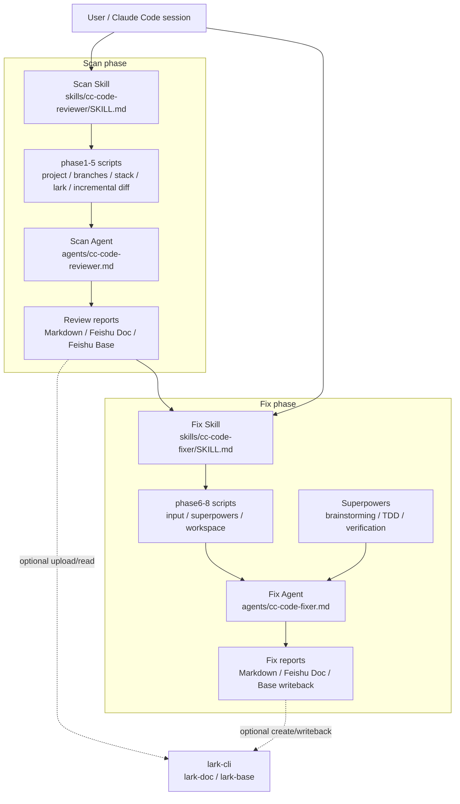

# CLAUDE.md

This file provides guidance to Claude Code (claude.ai/code) when working with code in this repository.

## Project Overview

This is a **Claude Code plugin skill** for enterprise-grade Java code review and report-driven fixing. It provides 15-dimension comprehensive analysis with 4 review modes (fast/standard/deep/security), supports incremental and stock review types, and can use review reports as input for a controlled fix stage.

**Important**: This repository intentionally uses **skill-only entry points** plus dedicated sub-agents. Claude Code can invoke the skills explicitly via `/cc-code-reviewer:cc-code-reviewer` for scan and `/cc-code-reviewer:cc-code-fixer` for fix.

## Architecture

### Overview



### Key Responsibilities

**Main Skill (`skills/cc-code-reviewer/SKILL.md`)**:
- Pre-scan: project detection → branch detection → project scan → lark-cli detection
- Interactive mode: Collect user config via AskUserQuestion (6 steps)
- Fast mode: Validate parameters and launch sub-agent directly
- **Never** execute code review itself

**Review Agent (`agents/cc-code-reviewer.md`)**:
- Execute actual code review with injected parameters
- Generate structured report
- Upload to Feishu (if requested)
- **Never** interact with user via AskUserQuestion

**Fix Skill (`skills/cc-code-fixer/SKILL.md`)**:
- Normalize fix input from local Markdown, Feishu Doc, or Feishu Base
- Preflight: project detection → branch detection → project scan → lark-cli detection → Superpowers detection
- Collect or validate fix plan: workspace strategy, severity/dimensions/issues, fix strategy, output target
- Prepare current branch, fix branch, or isolated worktree through phase8
- **Never** execute repairs itself

**Fix Agent (`agents/cc-code-fixer.md`)**:
- Consume the injected review report / normalized issue list and confirmed fix plan
- Start with brainstorming context, then follow test-driven-development and verification-before-completion
- Generate `fix-report-{PROJECT_NAME}-{YYYYMMDD-HHmmss}.md`
- Optionally create a Feishu Doc or write repair status back to Feishu Base
- **Never** repair out-of-scope issues or re-ask the user

### Execution Contract (Highest Priority)

These rules **must** be strictly followed:

1. **Pre-scan before interaction**: Execute scan/fix preflight scripts first, collect environment data
2. **Summary before questions**: Output a preflight summary once, only after the required scripts complete
3. **Structured interaction**: In interactive mode, use AskUserQuestion for each step separately
4. **Fast mode no interaction**: For scan, `--mode` triggers fast mode; for fix, scope/workspace/strategy selectors trigger fast mode. Validate and launch sub-agent immediately, no AskUserQuestion
5. **No text replacement**: Never use plain text questions to replace AskUserQuestion steps
6. **Never skip summary**: Even if all parameters provided, always show pre-scan summary
7. **Fix stage honors confirmed scope**: `cc-code-fixer` must only repair the injected issue set selected by severity, dimension, or issue id
8. **Fix stage uses controlled workspace**: prefer isolated worktree unless the user explicitly chooses current branch or fix branch

## File Structure

```
skills/cc-code-reviewer/SKILL.md    # Main skill definition (entry point)
skills/cc-code-fixer/SKILL.md       # Fix-stage skill definition
agents/cc-code-reviewer.md          # Sub agent for review execution
agents/cc-code-fixer.md             # Sub agent for report-driven fixing
references/
  ├── review-framework.md             # 15 dimensions definition + mode matrix
  ├── report-format.md                # Report output format specification
  ├── feishu-integration.md           # Feishu upload operation reference
  ├── fix-workflow.md                 # Fix-stage workflow contract
  ├── fix-report-format.md            # Fix report output format
  ├── fix-feishu-integration.md       # Fix-stage Feishu read/write contract
  └── examples.md                     # Complete example dialogues
scripts/
  ├── phase1-detect-project.sh        # Project identification
  ├── phase2-detect-branches.sh       # Branch detection
  ├── phase2-switch-branch.sh         # Branch switching
  ├── phase3-project-scan.sh          # Project structure scan
  ├── phase4-detect-lark-plugin.sh    # lark-cli detection
  ├── phase5-prepare-incremental.sh   # Incremental review preparation
  ├── phase6-detect-fix-input.sh      # Fix input detection
  ├── phase7-detect-superpowers.sh    # Superpowers workflow detection
  └── phase8-prepare-fix-workspace.sh # Fix branch/worktree preparation
```

## Common Development Tasks

### Running The Full Test Suite

Run this before handing off changes:

```bash
bash tests/run_all.sh
```

The suite runs every `tests/test_*.sh` file and then `git diff --check`. It covers:
- `phase1-detect-project.sh`: local path detection and missing-path failures
- `phase2-detect-branches.sh` / `phase2-switch-branch.sh`: branch discovery, clean local checkout, dirty local workspace protection
- `phase3-project-scan.sh`: Maven multi-module scans, module paths with spaces, unknown-project line counts
- `phase4-detect-lark-plugin.sh`: lark-cli detection output contract
- `phase5-prepare-incremental.sh`: incremental diff ranges that include the root commit
- `phase6-detect-fix-input.sh`: local Markdown, Feishu Doc, Feishu Base, and compact Base selectors
- `phase7-detect-superpowers.sh`: required Superpowers skill discovery
- `phase8-prepare-fix-workspace.sh`: current/branch/worktree strategies and dirty workspace protection
- Documentation contracts for fast-mode parameter validation, report persistence, Feishu Base fields, fix-stage contracts, and test instructions

PowerShell scripts mirror the Bash scripts, but the automated local suite runs Bash. When editing `.ps1` files, verify them separately on Windows or a machine with PowerShell.

### Testing Scripts Individually

```bash
# Test pre-scan scripts independently
bash scripts/phase1-detect-project.sh "/path/to/project"
bash scripts/phase2-detect-branches.sh "/path/to/project"
bash scripts/phase3-project-scan.sh "/path/to/project"
bash scripts/phase4-detect-lark-plugin.sh
bash scripts/phase5-prepare-incremental.sh "/path/to/project" 5
bash scripts/phase6-detect-fix-input.sh "/path/to/report.md"
bash scripts/phase7-detect-superpowers.sh
bash scripts/phase8-prepare-fix-workspace.sh "/path/to/project" worktree "fix/review-findings"
```

### Modifying Review Logic

1. **Script logic**: Edit `scripts/*.sh` files directly
2. **Review flow**: Edit `skills/cc-code-reviewer/SKILL.md`
3. **Review dimensions**: Edit `references/review-framework.md`
4. **Agent prompt**: Edit `agents/cc-code-reviewer.md`

**Critical**: Keep mode × dimension matrix consistent between `review-framework.md` and `cc-code-reviewer.md`.

### Modifying Fix Logic

1. **Fix flow**: Edit `skills/cc-code-fixer/SKILL.md`
2. **Fix agent prompt**: Edit `agents/cc-code-fixer.md`
3. **Input/workspace scripts**: Edit phase6-8 Bash and PowerShell mirrors together
4. **Fix report or Feishu contracts**: Edit `references/fix-report-format.md` and `references/fix-feishu-integration.md`

**Critical**: Keep fix statuses, strategy names, injected parameter names, and report filename conventions consistent across skill, agent, references, examples, and tests.

### Plugin Installation

After making changes, reload the plugin:

```bash
/reload-plugins
```

Verify installation by triggering the skill with a Java review request such as `帮我审查这个项目 /path/to/project`.

## Important Notes

### Scan Mode Detection

- **Interactive mode**: No `--mode` parameter → 6-step AskUserQuestion flow
- **Fast mode**: Has `--mode` parameter → Validate and execute directly

### Fix Mode Detection

- **Interactive mode**: only input/project are present → parse report, summarize fix candidates, then collect plan via AskUserQuestion
- **Fast mode**: fix selectors such as `--scope`, `--severity`, `--dimensions`, `--issues`, `--workspace`, `--strategy`, `--upload`, `--output`, `--branch`, or `--verify` are present → validate and execute directly
- **No `--mode` parameter**: `cc-code-fixer` intentionally does not use scan-stage `--mode`

### AskUserQuestion Usage

Each interaction step must:
- Call AskUserQuestion exactly once
- Set `multiSelect: false`, except the multi-module stock-review scope step where selecting multiple modules is allowed
- Present clear options with descriptions
- Wait for user response before proceeding

**Never**: Merge multiple steps into one message, or use plain text questions.

### Parameter Injection

Sub agent receives parameters via prompt injection, including:
- Project path, type, scope, mode
- Pre-scan results (project structure, modules)
- Incremental data (git log, changed files, diff stats)

**Sub agent must**: Use these parameters directly, never re-ask user.

### Feishu Integration

Uses `lark-cli` command with:
- `lark-doc` skill for cloud documents
- `lark-base` skill for bitable (multi-dimensional tables)

**Never** use deprecated tools like `feishu_create_doc` or `feishu_bitable_*`.

### Report Format

Report format is defined in `references/report-format.md` — follow it exactly when modifying output structure.

Fix report format is defined in `references/fix-report-format.md`. Feishu fix-stage read/write behavior is defined in `references/fix-feishu-integration.md`.
