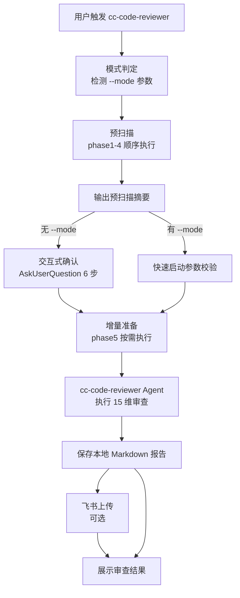
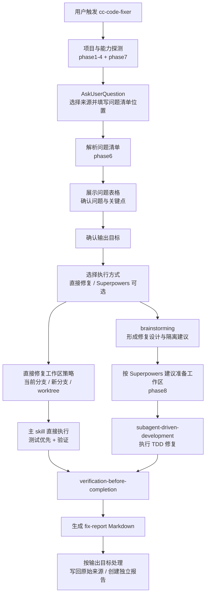

# Java Code Reviewer Plugin

> **⚠️ 平台说明**：本插件为 **Claude Code 专用插件**，基于 Claude Code 的 Agent 机制和 Plugin 规范开发。

企业级 Java 代码审查插件，支持 15 个维度全面审查、4 种审查模式、增量/存量两种审查类型；Scan 阶段支持交互式和快速启动，Fix 阶段固定走人工确认后的报告驱动修复。

## 快速上手

```bash
# 1. 安装插件
claude plugin marketplace add ataskite/cc-code-reviewer
claude plugin install cc-code-reviewer

# 2. 启动 Claude Code 会话，重载插件
/reload-plugins

# 3. 开始审查
/cc-code-reviewer:cc-code-reviewer /path/to/your/java/project
```

插件会自动识别项目结构，引导你选择审查类型、范围和模式。也可以用自然语言触发，例如 `帮我审查 /path/to/project`。

## 特性

- **15 维度全面审查**：正确性、代码质量、安全、性能、架构等
- **4 种审查模式**：fast（快速扫雷）、standard（日常推荐）、deep（大版本上线）、security（安全专项）
- **2 种审查类型**：增量审查（最近 N 次提交）、存量审查（全量/指定模块）
- **2 种审查使用模式**：交互式（逐步引导）、快速启动（自动化/CI/CD）
- **报告驱动修复**：基于本地 Markdown、飞书云文档或飞书多维表格中的确认问题清单，支持直接修复；Superpowers 可选
- **飞书集成**：审查报告上传云文档、问题清单录入多维表格（可选，依赖 lark-cli）
- **Bash 脚本**：仅支持 macOS/Linux，无 Python 依赖

## 架构总览


整体架构是 **skill 编排、脚本做环境探测、Scan Agent 审查、Fix Skill 报告驱动修复** 的结构。Scan Skill 负责模式判定、预检、用户确认和参数注入；Scan Agent 负责真正的 15 维审查，不再反问用户；Fix Skill 负责预检、收集确认问题清单、选择执行方式和输出目标，然后直接修复，或在检测到 Superpowers 完整可用时交给 `brainstorming` 与 `subagent-driven-development` 设计并执行修复。脚本保持可独立测试，并统一使用 Bash 维护。

Scan 阶段由 AI 产出候选问题报告；候选问题进入 Fix 阶段前，建议先经过人工审核与筛选，确认误报、补充企业内部上下文、选择修复范围，并形成真正要修复的 Fix TODO List。Fix 阶段只消费明确选择的问题，通过「问题清单位置」、修复范围、关键点、输出目标和执行方式的逐步确认进入修复。直接开始修复时会继续确认当前分支、新分支或 worktree；使用 Superpowers 修复时才进入 brainstorming 和 subagent-driven-development。

## 安装

### 前置条件

- Claude Code 已安装
- macOS/Linux：Bash 3.0+ 环境
- 系统已安装 `git` 命令

### 安装插件

```bash
# 1. 添加插件市场
claude plugin marketplace add ataskite/cc-code-reviewer

# 2. 安装插件
claude plugin install cc-code-reviewer
```

### 验证安装

启动 Claude Code 后执行：

```
/reload-plugins
```

然后输入 `/cc-code-reviewer:cc-code-reviewer` 并跟一个项目路径，如果能触发预扫描流程，说明安装成功。

### 更新插件

```bash
# 在终端执行（非 Claude Code 会话内）
claude plugin update cc-code-reviewer

# 进入 Claude Code 会话后重载
/reload-plugins
```

### 可选：lark-cli 安装

如需使用飞书上传功能（云文档/多维表格），需安装 `lark-cli` 并启用 `lark-doc`、`lark-base` 技能：

```bash
npm install -g @larksuite/cli
npx skills add larksuite/cli -y -g
lark-cli config init
lark-cli auth login --recommend
```

未安装 lark-cli 不影响审查功能，仅无法上传飞书。详细安装指南见 [lark-cli README](https://github.com/larksuite/cli/blob/main/README.zh.md)。

---

## 使用方式

Scan 阶段支持两种使用模式：**交互式模式**（默认）和**快速启动模式**（适合自动化）。Fix 阶段不支持快速启动，必须先由用户确认问题清单、修复范围、关键点和输出目标。

### 方式一：交互式模式（推荐日常使用）

使用 Claude Code 的快速引用格式触发，或用自然语言触发：

```
# 快速引用（推荐）
/cc-code-reviewer:cc-code-reviewer /path/to/project

# 自然语言
帮我审查 /path/to/project

# Git 仓库也支持
/cc-code-reviewer:cc-code-reviewer https://github.com/org/repo.git
```

触发后的流程：

1. **预扫描**（自动，无需操作）：项目识别 → 分支探测 → 项目/技术栈扫描 → lark-cli 检测
2. **预扫描摘要**：展示项目来源、Git 分支、Java 文件数/代码行数、模块列表、技术栈、飞书能力
3. **逐步确认**（通过选择按钮交互，共 6 步，其中 3 步为条件步骤）：
   - 步骤 1：选择分支 — *条件步骤，仅多分支 Git 仓库时询问*
   - 步骤 2：选择审查类型（增量/存量）
   - 步骤 3：选择审查范围 — *条件步骤，增量时先展示最近 10 次提交预览再选提交次数，多模块存量时选模块，单模块存量自动跳过*
   - 步骤 4：选择审查模式（fast/standard/deep/security）
   - 步骤 5：飞书上传选项 — *条件步骤，仅 lark-cli 可用时询问*
   - 步骤 6：确认执行计划
4. 确认后启动子 Agent 执行审查

### 方式二：快速启动模式（适合 CI/CD）

通过 `--mode` 参数直接传入全部配置，跳过所有交互：

```
帮我审查 /path/to/project --mode <模式> --type <类型> --scope <范围>
```

快速启动支持 `--key value` 和 `--key=value` 两种参数写法。

#### 参数说明

| 参数 | 必填 | 取值 | 说明 |
|------|------|------|------|
| `--mode` | 必填 | `fast` / `standard` / `deep` / `security` | 审查模式 |
| `--type` | 必填 | `incremental` / `stock` | 增量审查 / 存量审查 |
| `--scope` | 条件必填 | 正整数 或 `full` 或模块名 | 增量时为提交次数；存量多模块时为模块名；存量单模块可省略 |
| `--branch` | 可选 | 分支名 | 审查分支，默认当前分支 |
| `--upload` | 可选 | `no` / `doc` / `bitable` / `both` | 飞书上传，默认 `no` |

快速启动支持 `--key value` 和 `--key=value` 两种写法。若同一参数重复出现，使用最后一次取值；未知参数、缺少参数值、非法取值会在预扫描摘要后直接报错，并展示已识别参数，且不会降级为交互式模式。

> **注意**：快速启动模式下，必填参数缺失会直接报错终止，不会降级为交互式模式。

#### 快速启动示例

```bash
# 增量快速扫雷（最简用法）
帮我审查 /path/to/project --mode fast --type incremental --scope 5

# 存量全量审查，上传飞书云文档
帮我审查 /path/to/project --mode standard --type stock --scope full --upload doc

# 指定模块存量审查，深度模式
帮我审查 /path/to/project --mode deep --type stock --scope user-service,order-service --upload both

# Git 仓库 + 指定分支
帮我审查 https://github.com/org/repo.git --mode standard --type incremental --scope 3 --branch develop --upload bitable
```

## 修复阶段

扫描阶段生成本地 Markdown、飞书云文档或飞书多维表格后，可以使用 `cc-code-fixer` 进入修复阶段。修复阶段必须交互确认，不支持快速启动；入口和 scan 阶段一样，只输入待修复项目地址即可。

```text
/cc-code-reviewer:cc-code-fixer /path/to/project
/cc-code-reviewer:cc-code-fixer https://github.com/org/repo.git
```

修复阶段第一步会通过 AskUserQuestion 要求用户先选择待修复问题确认清单来源，再填写「问题清单位置」。清单可以是人工确认过的本地 Markdown，也可以是 scan 阶段产出的飞书云文档或飞书多维表格链接。修复器解析后会先展示问题清单表格，要求用户确认哪些问题纳入修复，再确认修复关键点、输出目标和执行方式。

输出目标会根据问题清单来源动态压缩：只展示一个写回原始来源选项，以及三个额外创建独立修复报告选项。比如输入源是本地 Markdown 时，选项为 `写回原始本地 Markdown`、`创建独立本地 Markdown 修复报告`、`创建独立飞书云文档修复报告`、`创建独立飞书多维表格修复报告`；输入源是飞书云文档时，第一个选项变为 `写回原始飞书云文档`；输入源是飞书多维表格时，第一个选项变为 `写回原始飞书多维表格`。

执行方式有两条：`直接开始修复` 和 `使用 Superpowers 修复`。Superpowers 可选，只有检测到相关技能完整安装时才展示该选项。直接开始修复会继续询问工作区策略：当前分支修复、创建新分支修复或创建 worktree 修复；使用 Superpowers 修复时从 `brainstorming` 开始，再通过 `subagent-driven-development` 进入设计、隔离和 TDD 修复。

修复完成后会生成本地审计用 `fix-report-{PROJECT_NAME}-{YYYYMMDD-HHmmss}.md`。如果输出目标选择写回原始来源，只更新本轮确认问题的修复状态、修复时间、修复分支、修复人和备注；如果选择独立修复报告，则不修改原始问题清单来源。修复时间取完成时的本地时间，修复分支取实际修复工作区当前分支，修复人取当前 Git 用户。

---

## 审查模式

| 模式 | 覆盖维度 | 适用场景 | 预估耗时 |
|------|---------|---------|---------|
| `fast` | 正确性、事务与配置安全、资源管理、P0级安全 | PR 合并前快速卡口 | 2-8 分钟 |
| `standard` | 1-11、14(部分)、15(部分) | 日常迭代上线前推荐 | 5-25 分钟 |
| `deep` | 全量 1-15 维度 | 大版本上线前、重要模块 | 10-60 分钟 |
| `security` | 安全核心 + 强相关交叉维度 | 安全合规检查、安全加固 | 5-35 分钟 |

## 15 个审查维度

| # | 维度 | 说明 |
|---|------|------|
| 1 | 正确性 | Bug、NPE、边界条件、异常处理、并发正确性 |
| 2 | 代码质量 | 单一职责、DRY、复杂度、命名、代码异味 |
| 3 | Spring Boot 规范 | 分层职责、依赖注入、事务、配置安全 |
| 4 | 数据库/数据访问 | 通用数据库、MyBatis、JPA/Hibernate、批量操作、数据一致性 |
| 5 | 安全 | 注入风险、对象级越权、租户隔离、敏感信息、文件/反序列化、JWT/会话、依赖供应链 |
| 6 | 性能 | 并发安全、线程池、算法复杂度、限流降级 |
| 7 | 资源管理 | 连接关闭、线程泄露、OOM风险 |
| 8 | 日志/可观测性 | 日志级别、敏感信息、健康检查 |
| 9 | 测试质量 | 覆盖率、核心逻辑测试、Mock使用 |
| 10 | 技术债 | 临时代码、过时API、设计模式 |
| 11 | 架构 | 模块化、耦合度、全局错误处理 |
| 12 | 分布式系统 | 分布式事务、分布式锁、服务间通信、熔断限流 |
| 13 | 消息队列 | 消息可靠性、幂等性、顺序性、死信队列 |
| 14 | 缓存 | 穿透/击穿/雪崩、一致性、Redis专项 |
| 15 | API 设计 | RESTful规范、版本管理、错误处理、分页 |

## 飞书多维表格

审查问题可录入飞书多维表格，包含 17 个字段：

- **基础字段（14个）**：问题编号、严重级别、所属维度、技术栈、问题描述、位置、置信度、证据、影响、修复建议、修复状态、审查模式、审查日期、备注
- **预留修复字段（3个）**：修复时间、修复分支、修复人（初始留空，供后续修复流程更新）

未上传飞书时，报告保存为 `code-review-report-{PROJECT_NAME}-{YYYYMMDD-HHmmss}.md`。

## 脚本说明

所有脚本位于 `scripts/` 目录，可独立运行测试，并统一使用 Bash。

### Scan 预扫描脚本（4 个，审查前顺序执行）

```bash
# 项目识别（输出项目路径、来源类型）
bash scripts/phase1-detect-project.sh "/path/to/project"

# 分支探测（输出 Git 分支列表）
bash scripts/phase2-detect-branches.sh "/path/to/project"

# 项目结构扫描（输出模块、技术栈、代码规模）
bash scripts/phase3-project-scan.sh "/path/to/project"

# lark-cli 检测（输出飞书上传能力）
bash scripts/phase4-detect-lark-plugin.sh
```

### 条件执行脚本（3 个，按需调用）

```bash
# 分支切换（交互式/快速启动模式下切换目标分支时执行）
bash scripts/phase2-switch-branch.sh "/path/to/project" "target-branch" "current-branch" "local|git-cache"

# 增量提交预览（交互式增量审查选择提交次数前展示最近 10 次提交）
bash scripts/phase5-preview-recent-commits.sh "/path/to/project"

# 增量审查准备（增量审查时生成提交记录、变更文件、diff 统计）
bash scripts/phase5-prepare-incremental.sh "/path/to/project" 5
```

### Fix 阶段脚本（4 个，按需调用）

```bash
# 修复输入检测（仅本地 Markdown 路径校验和绝对路径归一化）
bash scripts/phase6-detect-fix-input.sh "/path/to/report.md"

# Superpowers 能力检测（可选执行路线）
bash scripts/phase7-detect-superpowers.sh

# 修复工作区准备（当前分支、新分支或 worktree）
bash scripts/phase8-prepare-fix-workspace.sh "/path/to/project" worktree "codex/fix-review-findings"

# 修复完成元数据采集
bash scripts/phase9-collect-fix-metadata.sh "/path/to/project"
```

Scan Agent 生成完整审查报告后，会先保存到项目目录下的 `code-review-report-{PROJECT_NAME}-{YYYYMMDD-HHmmss}.md`。选择飞书上传时也复用这份 Markdown 文件；未上传或上传失败时，会在对话中展示该本地报告路径和完整报告内容。Fix 阶段则生成本地审计用 `fix-report-{PROJECT_NAME}-{YYYYMMDD-HHmmss}.md`，并按用户选择写回原始问题清单来源，或额外创建独立本地 Markdown、飞书云文档、飞书多维表格修复报告。

## 测试

提交前优先运行完整 Bash 测试套件：

```bash
bash tests/run_all.sh
```

当前测试覆盖：
- `phase1-detect-project.sh`：本地路径识别、缺失路径失败输出
- `phase2-detect-branches.sh` / `phase2-switch-branch.sh`：分支探测、本地干净工作区切换、本地脏工作区保护
- `phase3-project-scan.sh`：Maven 多模块扫描、包含空格的模块路径、unknown 项目行数统计
- `phase4-detect-lark-plugin.sh`：lark-cli 可用/不可用输出契约
- `phase5-preview-recent-commits.sh`：最近 10 次提交的编号预览
- `phase5-prepare-incremental.sh`：最近 N 次提交覆盖到首提交时的 diff 边界
- `phase6-detect-fix-input.sh`：本地 Markdown 路径存在性校验和绝对路径归一化；飞书云文档和飞书多维表格由 lark-doc / lark-base 读取
- `phase7-detect-superpowers.sh`：Superpowers 可选执行路线的技能发现
- `phase8-prepare-fix-workspace.sh`：当前分支、新分支和 worktree 策略，脏工作区保护
- `phase9-collect-fix-metadata.sh`：修复完成时间、实际修复分支和当前 Git 用户采集
- 文档契约：主 skill 参数完整性、报告文件持久化、飞书 Base 字段去重、Fix 阶段交互门禁、直接修复与 Superpowers 可选路线、测试入口说明

`tests/run_all.sh` 会按文件名顺序执行 `tests/test_*.sh`，最后运行 `git diff --check` 检查空白问题。

## 工作流程

### Scan 阶段



### Fix 阶段



## 开发与维护

### 修改脚本逻辑
1. 编辑 `scripts/` 下对应的 `.sh` 文件
2. 在 macOS/Linux 环境运行测试验证
3. 无需修改 `skills/cc-code-reviewer/SKILL.md`（脚本通过路径引用），除非新增或调整脚本调用契约

### 修改审查流程
1. 编辑 `skills/cc-code-reviewer/SKILL.md` 中对应阶段的描述
2. 如需新脚本，在 `scripts/` 目录创建

### 修改审查维度或提示词
1. 审查框架：编辑 `references/review-framework.md`
2. Agent 提示词：编辑 `agents/cc-code-reviewer.md`
3. 确保模式×维度矩阵在两个文件中保持一致

### 修改修复流程
1. Fix 入口流程：编辑 `skills/cc-code-fixer/SKILL.md`
2. Fix 输入、Superpowers 检测或工作区准备：编辑 `scripts/phase6-8*.sh`
3. 修复报告格式和飞书读写：编辑 `references/fix-report-format.md` 与 `references/fix-feishu-integration.md`
4. 同步示例、README 和 `tests/test_contract_docs.sh`，确保「问题清单位置」、动态输出目标、直接修复 / Superpowers 可选路线和无专用 fixer agent 的契约一致

## License

MIT
