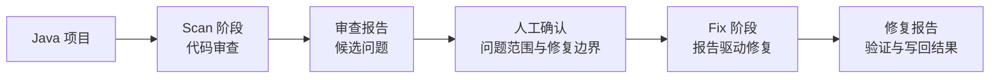
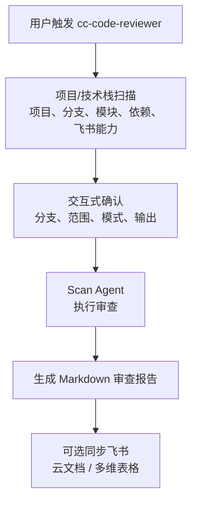
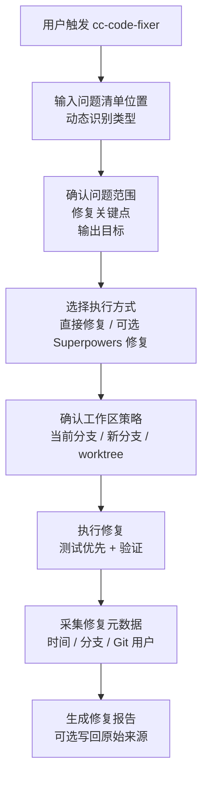

# Java Code Reviewer Plugin

> **平台说明**：本插件为 **Claude Code 专用插件**，基于 Claude Code 的 Agent 机制和 Plugin 规范开发。

`cc-code-reviewer` 是一个面向企业 Java 项目的 Claude Code 插件，目标不是只生成一份代码审查报告，而是打通 **扫描 → 人工确认 → 修复 → 验证 → 报告/写回** 的完整闭环。Scan 阶段负责发现和结构化问题，Fix 阶段基于确认后的问题清单执行修复，并把修复状态、修复时间、修复分支和修复人写入修复报告或原始问题来源。

## 产品定位

`cc-code-reviewer` 解决的是两个相邻但不同的问题：

- **发现问题**：对 Java 项目进行结构化审查，输出本地 Markdown 报告，并可选同步到飞书云文档或多维表格。
- **修复问题**：消费经过人工确认的问题清单，只修复本轮明确纳入范围的问题，并生成可审计的修复报告。

插件的主要产物包括：

- **审查报告**：`code-review-report-{PROJECT_NAME}-{YYYYMMDD-HHmmss}.md`
- **问题清单**：本地 Markdown、飞书云文档或飞书多维表格
- **修复报告**：`fix-report-{PROJECT_NAME}-{YYYYMMDD-HHmmss}.md`

Scan 和 Fix 是并列阶段，而不是一个阶段里的两个按钮。Scan 产出候选问题，Fix 只消费人工确认后的问题清单；Scan 不修改业务代码，Fix 不重新执行完整审查。

## 核心能力

- **端到端闭环**：覆盖 Scan → 人工确认 → Fix → 验证 → 报告/写回。
- **技术栈感知审查**：先识别项目技术栈，再动态匹配审查维度和专项规则。
- **15 个基础维度**：覆盖正确性、代码质量、安全、性能、架构、缓存、消息队列、API 设计等方向。
- **交互式 Scan**：预扫描后逐步确认分支、范围、模式、输出和执行计划。
- **大仓库分批扫描**：自动将大仓库拆分为多批次并行扫描，合并去重后输出统一报告。
- **项目级 ignore**：把反复出现的误报或项目特有设计沉淀到本地 ignore 文件，后续 Scan 自动跳过同类问题。
- **多种审查范围**：支持增量审查、存量审查和指定模块审查。
- **多种输出形态**：支持本地 Markdown，也可选输出到飞书云文档或飞书多维表格。
- **报告驱动 Fix**：严格基于人工确认的问题清单，不把候选问题直接改进代码。
- **修复路线可控**：默认由主 Skill 直接修复；检测到 Superpowers 完整可用且用户选择时，才启用 Superpowers 辅助路线。
- **修复结果可追踪**：支持写回原始来源，并自动采集修复时间、修复分支和修复人。

## 端到端工作流

### 总体闭环流程



### Scan 阶段：发现问题并生成候选问题清单



Scan 阶段会先做项目/技术栈扫描，识别模块结构、代码规模、Git 分支、依赖指纹和 lark-cli 能力。审查模式决定基础覆盖范围，技术栈识别决定专项规则和重点审查方向。

### 人工确认：从候选问题到待修复问题清单

Scan 报告进入 Fix 前，建议先经过人工审核与筛选：确认误报、补充企业内部上下文、选择修复范围，并形成真正要修复的 Fix TODO List。未确认的问题不会进入 Fix。

### Fix 阶段：修复确认后的问题并验证



修复阶段必须交互确认。它只修复用户确认的问题，不扩大范围；修复完成后自动采集修复时间、实际修复分支和当前 Git 用户，并写入报告或原始问题清单。

### 输出闭环：修复报告与可选飞书写回

Fix 阶段始终生成本地修复报告。如果选择写回原始来源，会同步更新本轮确认问题的修复状态、修复时间、修复分支、修复人和备注；如果选择独立报告，则不改动原始问题清单。

## 快速上手

### 前置条件与支持环境

- 已安装 Claude Code
- macOS 或 Linux
- Bash 3.0+
- 已安装 `git`
- 如需飞书云文档或多维表格能力，可选安装 `lark-cli`

### 安装插件

```bash
claude plugin marketplace add ataskite/cc-code-reviewer
claude plugin install cc-code-reviewer
```

### 重载与验证插件

启动 Claude Code 后执行：

```text
/reload-plugins
```

然后输入 `/cc-code-reviewer:cc-code-reviewer` 并跟一个项目路径，如果能触发预扫描流程，说明安装成功。

### 可选安装 lark-cli

如需使用飞书上传或写回功能，需安装 `lark-cli` 并启用 `lark-doc`、`lark-base` 技能：

```bash
npm install -g @larksuite/cli
npx skills add larksuite/cli -y -g
lark-cli config init
lark-cli auth login --recommend
```

未安装 lark-cli 不影响本地审查和本地修复报告生成。详细安装指南见 [lark-cli README](https://github.com/larksuite/cli/blob/main/README.zh.md)。

### 发起一次 Scan

```text
/cc-code-reviewer:cc-code-reviewer /path/to/project
```

也可以用自然语言触发：

```text
帮我审查 /path/to/project
```

Git 仓库地址也支持：

```text
/cc-code-reviewer:cc-code-reviewer https://github.com/org/repo.git
```

### 基于报告发起一次 Fix

```text
/cc-code-reviewer:cc-code-fixer /path/to/project
```

Fix 阶段会要求你输入待修复问题确认清单的本地路径或飞书链接，并根据输入动态识别为本地 Markdown、飞书云文档或飞书多维表格；解析后会先过滤明确标注为已修复、已忽略或不适用的问题，再确认修复范围、关键点、输出目标和执行方式。

### 沉淀项目级 ignore

当扫描清单中出现项目特有设计或误报时，可以把代表性问题沉淀为本地 ignore 规则：

1. 先运行 Scan，生成本地 Markdown 报告、飞书云文档或飞书多维表格问题清单。
2. 再运行 ignore 技能，并传入项目路径：

```text
/cc-code-reviewer:cc-code-ignore /path/to/project
```

3. 按交互提示提供问题清单位置。支持飞书 Base 链接或本地 Markdown 路径；如果直接粘贴到 Other/free-form，技能会动态识别来源。
4. 从展示的问题摘要中选择一个或多个代表性问题编号，例如 `P1-2`、`P2-4` 或 `待确认-1`。这些编号只用于本次定位代表问题，不会写入 ignore 文件。
5. 检查技能生成的 YAML 片段，确认后写入：

```text
{PROJECT_DIR}/.cc-code-reviewer/ignore/issues.yml
```

ignore 文件面向 AI 扫描读取，也方便人工手改。它不存报告编号，只存同类问题的跳过指令：

```yaml
version: 1

ignore:
  - name: "Controller 未显式鉴权"
    applies_to:
      - "所有 Controller 接口"
      - "Spring MVC 请求入口"
    skip_when: |
      如果发现的问题是 Controller 方法缺少 @PreAuthorize、@RequiresPermissions、
      权限注解、显式鉴权调用，或类似“接口未做权限校验”的结论，
      后续扫描不要再把这类问题列为扫描问题。
```

后续 Scan 会在预扫描后自动读取该文件，并把规则注入 scan agent。语义命中 `skip_when` 的同类问题不会进入扫描问题清单；报告中会披露项目 ignore 是否启用、命中规则数和过滤问题数。

### 更新插件

```bash
claude plugin update cc-code-reviewer@cc-code-reviewer
```

更新后进入 Claude Code 会话执行：

```text
/reload-plugins
```

## Scan 阶段说明

### 适用场景

Scan 阶段用于发现问题和形成候选问题清单，适合：

- PR 合并前快速扫雷
- 日常迭代上线前审查
- 大版本发布前深度审查
- 安全专项检查
- 存量项目质量摸底

### 交互式流程

Scan 阶段只保留交互式流程。触发后插件会先自动完成预扫描，再通过选择按钮逐步确认：

1. 分支选择：仅多分支 Git 仓库时询问
2. 审查类型：增量审查或存量审查
3. 审查范围：最近 N 次提交、全量代码或指定模块
4. 审查模式：`fast`、`standard`、`deep`、`security`
5. 审查结果处理方式：默认本地 Markdown 报告；仅 lark-cli 可用时提供飞书选项
6. 本轮执行批次：仅 Maven 大仓库存量全量审查时先展示批次表和预估计划，再让用户选择
7. 并发数选择：仅分批审查时询问（BATCH_MODE=true）
8. 最终执行计划确认

### 审查模式

| 模式 | 基础覆盖范围 | 适用场景 | 预估耗时 |
|------|--------------|----------|----------|
| `fast` | 正确性、事务与配置安全、资源管理、P0 级安全 | PR 合并前快速卡口 | 2-8 分钟 |
| `standard` | 1-11、14 部分、15 部分 | 日常迭代上线前推荐 | 5-25 分钟 |
| `deep` | 全量 1-15 维度 | 大版本上线前、重要模块 | 10-60 分钟 |
| `security` | 安全核心 + 强相关交叉维度 | 安全合规检查、安全加固 | 5-35 分钟 |

### 审查范围

- **增量审查**：审查最近 N 次提交对应的变更文件和 diff。
- **存量审查**：审查全量代码或指定模块。
- **指定模块审查**：多模块项目可选择一个或多个模块。

### 大仓库分批扫描

Maven 多模块项目在存量全量审查且规模超过阈值时，会进入可恢复的大仓库批次任务：

- 触发条件：Maven 多模块 + 存量审查 + 全量代码 + `TOTAL_JAVA_LOC >= 120000`
- 批次按 Maven 模块代码行数和 reactor 依赖关系规划，默认目标约 25,000 行/批
- 批次是原子的：已完成批次跨会话保留，未完成批次整批重跑
- 每次可选择执行 3 / 5 / 10 批或全部未完成批次，适合跨天继续
- jdtls-lsp 可用时用于跨目录理解调用链；不可用时回退 Maven 静态依赖分批
- 子 agent 只在本批 `scan_roots` 内输出正式问题，跨批风险记录为“跨批依赖待复核”
- 合并报告只读取已完成批次；未完成时生成 `[阶段性]` 报告，全部完成后生成完整报告

### 技术栈识别与审查维度动态匹配

15 个维度是基础框架，不是机械地对所有项目全量套用。Scan 阶段会先识别项目技术栈，再动态强化相关维度：

- 识别到 Spring Boot 时，强化分层职责、依赖注入、事务边界、配置安全等规则。
- 识别到 MyBatis、MyBatis Plus、JPA/Hibernate 时，强化 SQL、批量操作、事务一致性、N+1 查询等规则。
- 识别到 Redis 时，强化缓存穿透、击穿、雪崩、一致性和序列化风险。
- 识别到 Kafka、RabbitMQ 等消息队列时，强化消息可靠性、幂等性、顺序性和死信处理。
- 识别到 JWT、Spring Security、Shiro 时，强化认证鉴权、对象级越权、敏感信息和会话安全。

审查模式决定“基础覆盖范围”，技术栈识别决定“专项规则和重点方向”。

### 15 个基础审查维度

| # | 维度 | 说明 |
|---|------|------|
| 1 | 正确性 | Bug、NPE、边界条件、异常处理、并发正确性 |
| 2 | 代码质量 | 单一职责、DRY、复杂度、命名、代码异味 |
| 3 | Spring Boot 规范 | 分层职责、依赖注入、事务、配置安全 |
| 4 | 数据库/数据访问 | 通用数据库、MyBatis、JPA/Hibernate、批量操作、数据一致性 |
| 5 | 安全 | 注入风险、对象级越权、租户隔离、敏感信息、文件/反序列化、JWT/会话、依赖供应链 |
| 6 | 性能 | 并发安全、线程池、算法复杂度、限流降级 |
| 7 | 资源管理 | 连接关闭、线程泄露、OOM 风险 |
| 8 | 日志/可观测性 | 日志级别、敏感信息、健康检查 |
| 9 | 测试质量 | 覆盖率、核心逻辑测试、Mock 使用 |
| 10 | 技术债 | 临时代码、过时 API、设计模式 |
| 11 | 架构 | 模块化、耦合度、全局错误处理 |
| 12 | 分布式系统 | 分布式事务、分布式锁、服务间通信、熔断限流 |
| 13 | 消息队列 | 消息可靠性、幂等性、顺序性、死信队列 |
| 14 | 缓存 | 穿透/击穿/雪崩、一致性、Redis 专项 |
| 15 | API 设计 | RESTful 规范、版本管理、错误处理、分页 |

### Scan 阶段输出

Scan Agent 生成完整审查报告后，会先保存到项目目录下：

```text
code-review-report-{PROJECT_NAME}-{YYYYMMDD-HHmmss}.md
```

如果选择飞书上传，会复用同一份 Markdown 文件创建云文档，或将问题清单写入飞书多维表格。未上传或上传失败时，本地 Markdown 报告仍是主产物。

### 飞书多维表格字段

审查问题可录入飞书多维表格，包含 17 个字段：

- **基础字段（14 个）**：问题编号、严重级别、所属维度、技术栈、问题描述、位置、置信度、证据、影响、修复建议、修复状态、审查模式、审查日期、备注
- **预留修复字段（3 个）**：修复时间、修复分支、修复人

预留修复字段在 Scan 阶段初始留空，供 Fix 阶段写回。

## Fix 阶段说明

### 适用场景

Fix 阶段用于把已经确认的问题清单转化为代码修复，适合：

- Scan 报告经过人工筛选后，需要修复其中一部分问题
- 飞书多维表格中已有待修复记录
- 本地 Markdown 中整理出了明确的 Fix TODO List
- 需要生成可追踪、可审计的修复报告

### 问题清单来源

Fix 阶段只让用户输入一次问题清单位置，不再先选择来源类型。输入后动态识别三类来源：

- **本地 Markdown**：人工确认后的审查报告或 Fix TODO List。
- **飞书云文档**：Scan 阶段上传或团队二次整理后的云文档。
- **飞书多维表格**：包含问题编号、位置、描述、修复建议和修复状态的问题清单。

问题清单可以重复传入。Fix 阶段会读取 `修复状态` / `fix_status` 等状态信息，默认只把空状态或 `待修复` 的问题纳入确认；明确标注为 `已修复`、`已忽略` 或 `不适用` 的问题会被跳过。

### 人工确认门禁

修复阶段必须交互确认。即使问题清单已经存在，也必须确认：

- 本轮纳入修复的问题编号
- 每个问题的修复意图、边界和不修内容
- 建议验证方式
- 输出目标
- 执行方式

这条门禁用于防止把候选问题、误报或尚未达成共识的问题直接改进代码。

### 输出目标

输出目标根据问题清单来源动态展示：

- 写回原始本地 Markdown
- 写回原始飞书云文档
- 写回原始飞书多维表格
- 创建独立本地 Markdown 修复报告
- 创建独立飞书云文档修复报告
- 创建独立飞书多维表格修复报告

用户选择独立修复报告时，不修改原始问题清单来源。用户选择写回原始来源时，只更新本轮确认问题对应的修复状态、修复时间、修复分支、修复人和备注。

### 执行方式

Fix 阶段支持默认直接修复，并在 Superpowers 完整可用时额外提供辅助路线：

- **直接修复**：由 Fix Skill 按确认范围直接执行修复、测试、验证和报告生成。
- **使用 Superpowers 修复**：在检测到 Superpowers 完整可用时，从 `brainstorming` 开始，再由 `subagent-driven-development` 执行修复计划。

Superpowers 可选，不完整安装时不阻塞直接修复路线。

### 工作区策略

直接修复路线会继续确认工作区策略：

- **当前分支修复**：适合已确认可以原地修改的场景。
- **创建新分支修复**：适合需要保留当前分支状态的场景。
- **创建 worktree 修复**：适合需要隔离较强的修复场景。

### 修复元数据

修复完成后自动采集：

- **修复时间**：完成时的本地时间
- **修复分支**：实际修复工作区当前分支
- **修复人**：当前 Git 用户

这些值用于生成修复报告，也用于写回原始问题清单。它们不需要用户手动填写。

### Fix 阶段输出

Fix 阶段始终生成本地审计报告：

```text
fix-report-{PROJECT_NAME}-{YYYYMMDD-HHmmss}.md
```

如果选择写回原始来源，会同步更新本轮确认问题的修复字段；如果选择独立报告，则不会改动原始问题清单。

## Harness 架构设计


本插件采用 Harness 架构设计：入口、Skill、Agent、人工门禁、执行路线和外部集成通过明确的输入输出契约连接，避免把审查、修复、环境探测和外部写回混在同一个步骤里。

### 整体 Harness 架构图

上图展示了完整闭环：用户从 Claude Code 入口触发插件，Scan 阶段发现候选问题，人工审核形成确认清单，Fix 阶段在交互确认后分支执行，lark-cli 作为可选平台读写能力横向支撑报告输出、问题清单读取和结果写回。

### 入口层：User / Claude Code

对应图里的 `1. 入口`。用户通过 Claude Code 触发 Scan 或 Fix，插件入口只负责接收意图和项目位置，不承担审查或修复本身。

### Scan Harness：发现候选问题

对应图里的 `2. Scan 阶段`，由 Scan Skill 和 Scan Agent 组成。

- **Scan Skill**：负责预检、交互式确认和参数注入。
- **Scan Agent**：负责执行审查并生成候选问题报告，不再反问用户。

### 人工确认层：从候选问题到 Fix TODO List

对应图里的 `3. 人工审核`。这是 Scan 和 Fix 的边界，用来确认误报、补充上下文和选择修复范围。未确认的问题不进入 Fix。

### Fix Harness：确认后分支执行

对应图里的 `4. Fix 阶段`。Fix Skill 负责项目预检、问题清单位置、确认范围、修复关键点、动态输出目标和执行方式选择。

### 修复执行层：直接修复 / 可选 Superpowers 修复

对应图右侧执行路线。默认路线是主 Skill 直接修复、测试、验证和报告生成；当 Superpowers 技能完整可用且用户明确选择时，可以走辅助路线，由 `brainstorming` 形成设计，再通过 TDD、verification 和 `subagent-driven-development` 执行。

### Integration 层：lark-cli 可选平台读写能力

对应图底部 `lark-cli` 横条。它不是主流程必需项，而是支撑飞书问题清单读取、原始来源写回、独立修复报告创建的可选集成。不可用时，本地 Markdown 报告仍然可用。

### Harness 边界

每层只做自己的事：Skill 负责入口、编排和交互门禁；Script 负责可重复的环境探测和工作区准备；Agent 负责高上下文审查任务；Fix 执行层负责在确认范围内完成修复与验证；Integration 层负责外部读写。

## License

MIT
