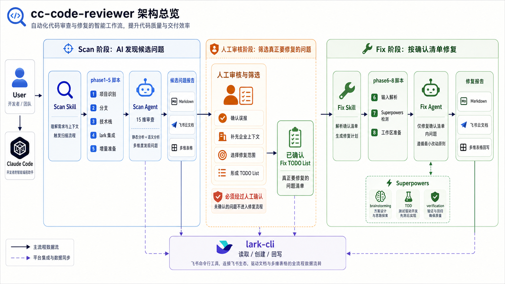

# cc-code-reviewer

> Claude Code 插件 · 企业级 Java 代码审查与报告驱动修复


打通 **扫描 → 人工确认 → 修复 → 验证 → 报告/写回** 的完整闭环。Scan 只发现问题，Fix 只消费确认后的问题——两个阶段严格分离。

## 快速上手

### 前置条件

- macOS / Linux + Bash 3.0+ + `git`
- 已安装 [Claude Code](https://claude.ai/code)
- 可选：[lark-cli](https://github.com/larksuite/cli/blob/main/README.zh.md)（飞书云文档/多维表格支持）

### 安装

```bash
claude plugin marketplace add ataskite/cc-code-reviewer
claude plugin install cc-code-reviewer
```

安装后在 Claude Code 会话内执行 `/reload-plugins` 即可使用。

### 发起审查

```text
/cc-code-reviewer:cc-code-reviewer /path/to/project
```

也支持自然语言（`帮我审查 /path/to/project`）或 Git 仓库地址。

### 发起修复

```text
/cc-code-reviewer:cc-code-fixer /path/to/project
```

输入本地 Markdown 路径、飞书云文档或飞书多维表格链接，按提示确认范围后执行修复。

### 沉淀 Ignore 规则

```text
/cc-code-reviewer:cc-code-ignore /path/to/project
```

把反复出现的误报或项目特有设计沉淀到 `.cc-code-reviewer/ignore/issues.yml`，后续 Scan 自动跳过同类问题。

### 更新插件

```bash
claude plugin update cc-code-reviewer@cc-code-reviewer
```

更新后在会话内执行 `/reload-plugins`。

## 核心能力

- **端到端闭环** — Scan 发现问题 → 人工确认 → Fix 修复验证 → 报告/写回
- **技术栈感知** — 自动识别 Spring Boot、MyBatis、Redis、Kafka 等，动态匹配专项审查规则
- **15 个基础维度** — 正确性、代码质量、安全、性能、架构、缓存、消息队列、API 设计等
- **4 种审查模式** — fast / standard / deep / security，按场景选择覆盖范围
- **可恢复分批扫描** — 大型 Maven 多模块或大项目自动规划批次，支持跨会话续跑
- **项目级 ignore** — 误报和项目特有设计沉淀为本地规则，后续自动跳过
- **报告驱动 Fix** — 严格基于人工确认的问题清单修复，不扩大范围
- **修复可追踪** — 自动采集修复时间、分支、Git 用户，支持写回原始来源

## 工作流

### Scan：发现问题

1. 预扫描 — 识别项目结构、模块、Git 分支、技术栈和 lark-cli 能力
2. 交互确认 — 逐步选择分支、模式、范围和执行计划
3. 执行审查 — Scan Agent 在确认参数下运行
4. 生成报告 — `code-review-report-{PROJECT}-{TIME}.md`，可选同步飞书

### 人工确认

Scan 报告进入 Fix 前，人工审核候选问题：确认误报、补充上下文、选择修复范围，形成待修复清单。未确认的问题不进入 Fix。

### Fix：修复验证

1. 输入问题清单 — 本地 Markdown / 飞书云文档 / 飞书多维表格
2. 确认范围 — 问题编号、修复意图、边界、输出目标
3. 执行修复 — 默认直接修复；Superpowers 完整可用时可选辅助路线
4. 生成报告 — `fix-report-{PROJECT}-{TIME}.md`，可选写回原始来源

## 审查模式

| 模式 | 覆盖范围 | 适用场景 | 预估耗时 |
|------|----------|----------|----------|
| `fast` | 正确性 + P0 安全 + 资源管理 | PR 合并前快速卡口 | 2-8 分钟 |
| `standard` | 维度 1-11 + 部分 14/15 | 日常迭代上线 | 5-25 分钟 |
| `deep` | 全量 1-15 维度 | 大版本发布前 | 10-60 分钟 |
| `security` | 安全核心 + 交叉维度 | 安全合规检查 | 5-35 分钟 |

审查范围支持 **增量**（最近 N 次提交）、**存量**（全量代码）和 **指定模块**。

## 架构



插件采用 Harness 架构：Skill 负责入口编排和交互门禁，Script 负责可重复的环境探测，Agent 负责高上下文审查任务，Fix 执行层在确认范围内完成修复与验证，lark-cli 作为可选集成提供飞书读写能力。每层只做自己的事，通过明确的输入输出契约连接。

## 详细文档

| 文档 | 说明 |
|------|------|
| [审查维度与模式矩阵](references/review-framework.md) | 15 维度定义、技术栈匹配规则、模式 × 维度启用矩阵 |
| [报告格式](references/report-format.md) | Scan 审查报告结构化输出规范 |
| [飞书集成](references/feishu-integration.md) | 云文档上传、多维表格读写操作参考 |
| [分批扫描](CLAUDE.md) | Maven 多模块 / 文件 token 分批规划与可恢复执行 |
| [修复工作流](references/fix-workflow.md) | Fix 阶段完整契约、交互门禁、执行路线 |
| [修复报告格式](references/fix-report-format.md) | 修复报告结构化输出规范 |
| [修复飞书写回](references/fix-feishu-integration.md) | Fix 阶段飞书读写操作契约 |
| [Ignore 规则](references/ignore-workflow.md) | 项目级 ignore 规则格式与维护流程 |
| [示例对话](references/examples.md) | Scan / Fix / Ignore 完整示例 |

## License

MIT
